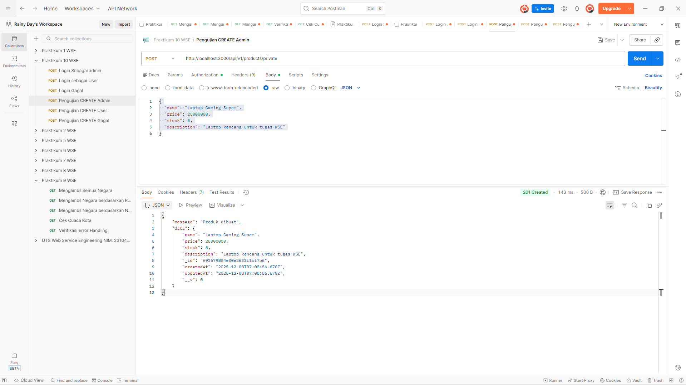
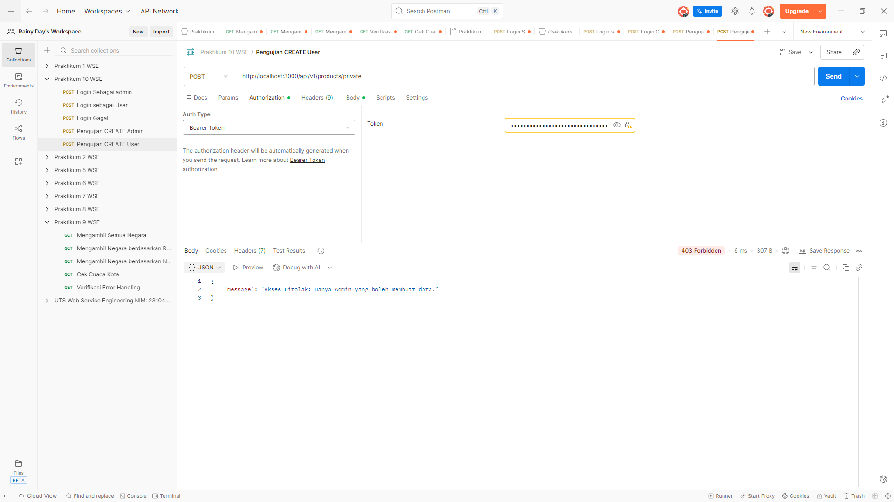
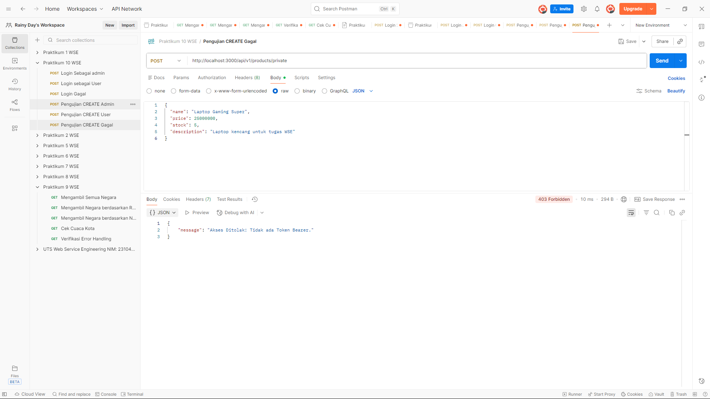
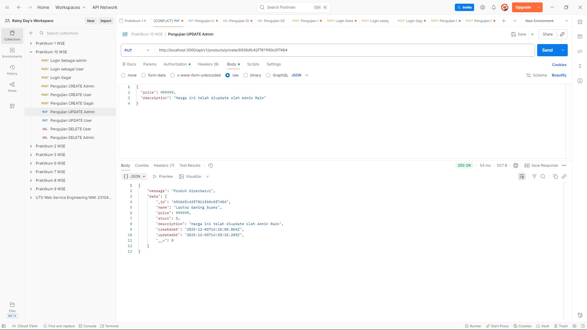
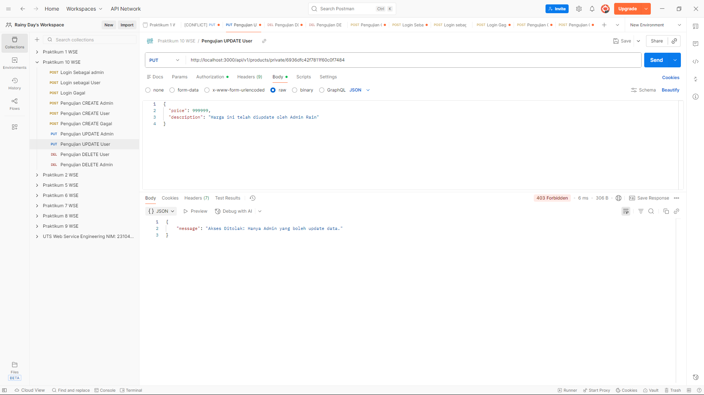

# Praktikum 10: Implementasi OAuth 2.0 & API Key Security


Proyek ini disusun **Untuk Memenuhi Praktikum 10 Web Service Engineering**.

Aplikasi ini adalah implementasi RESTful API yang menerapkan standar keamanan ganda menggunakan **API Key** untuk akses publik dan **OAuth 2.0 (JWT)** untuk akses privat dengan validasi peran (Role-Based Access Control).

---

## 👤 Identitas Pengembang
* **Nama:** Ivan Dwika Bagaskara (Rain)
* **NIM:** 230104040205
* **Topik:** Keamanan Web Service (API Key & JWT)

---

## 🚀 Fitur Utama
1.  **Public Access (API Key):** Endpoint `GET` produk dilindungi oleh API Key fisik.
2.  **Authentication (JWT):** Login user menggunakan username & password (terenkripsi `bcrypt`) untuk mendapatkan Token JWT.
3.  **Authorization (RBAC):**
    * **Admin:** Akses penuh (Create, Read, Update, Delete).
    * **User Biasa:** Hanya akses Read, dilarang mengubah data (Forbidden 403).
4.  **Database Seeding:** Script otomatis untuk mengisi data awal.
5.  **Cloud Database:** Terintegrasi dengan MongoDB Atlas.

---

## 📂 Struktur Folder
```text
p10-oauth2-api-key/
├── controllers/      # Logika bisnis (Auth & Product)
├── evidence/         # Bukti screenshot pengujian (Test Evidence)
├── middleware/       # Satpam (Validate Token & API Key)
├── models/           # Skema Database (User, Product, ApiKey)
├── routes/           # Definisi Endpoint API
├── seeders/          # Script pengisi data awal
├── utils/            # Fungsi bantuan (Token Generator)
├── .env              # Variabel lingkungan (Local only)
├── server.js         # Entry point aplikasi
└── package.json      # Daftar dependency

```

---

## 📸 Bukti Pengujian (Test Evidence)

Berikut adalah daftar skenario pengujian yang telah dilakukan dan buktinya tersimpan dalam folder `/evidence`.

### 1. Otentikasi (Auth)

| Skenario | Status Code | Bukti Gambar |
| --- | --- | --- |
| **Login Admin** | `200 OK` |  |
| **Login User Biasa** | `200 OK` |  |
| **Login Gagal** (Password Salah) | `401 Unauthorized` |  |

### 2. Manajemen Produk (CRUD & RBAC)

| Skenario | Aktor | Hasil | Bukti Gambar |
| --- | --- | --- | --- |
| **Create Product** | Admin | **Sukses** |  |
| **Create Product** | User | **Gagal (403)** |  |
| **Create Product** | Anonim | **Gagal (403)** |  |
| **Update Product** | Admin | **Sukses** |  |
| **Update Product** | User | **Gagal (403)** |  |
| **Delete Product** | Admin | **Sukses** |  |
| **Delete Product** | User | **Gagal (403)** |  |

---

## ⚙️ Cara Instalasi & Menjalankan

### 1. Install Dependencies

```bash
npm install

```

### 2. Konfigurasi Environment (.env)

Buat file `.env` dan sesuaikan dengan kredensial MongoDB Atlas Anda:

```env
PORT=3000
MONGODB_URI=mongodb+srv://...
JWT_SECRET=rahasia-super-aman-simulasi-jwt-rain

```

### 3. Database Seeding

Jalankan perintah ini untuk me-reset dan mengisi data awal:

```bash
node seeders/seed.js

```

### 4. Jalankan Server

```bash
node server.js

```

---

## 🧪 Akun Pengujian

| Role | Username | Password |
| --- | --- | --- |
| **Admin** | `admin` | `password123` |
| **User** | `userbiasa` | `userpass` |

**API Key Publik:** `API_KEY_RAIN_SECRET_123`